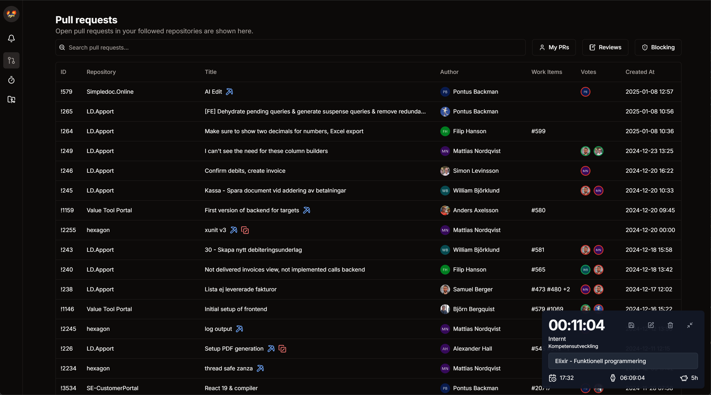
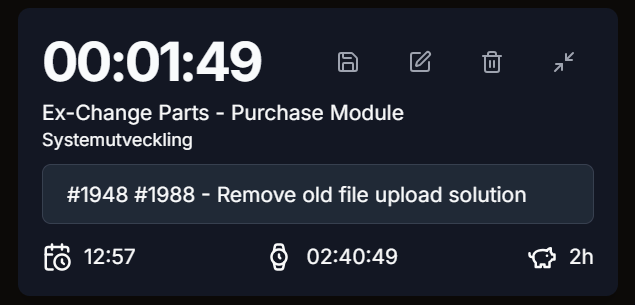
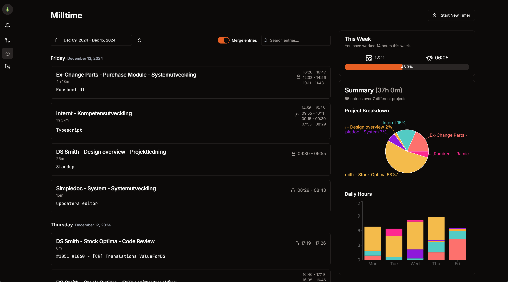
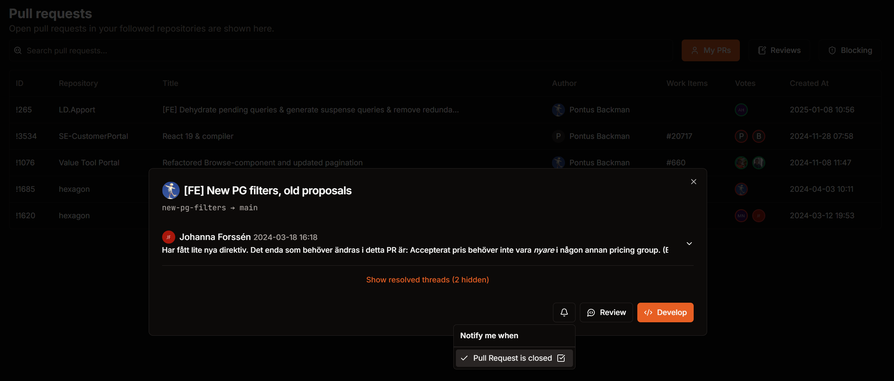
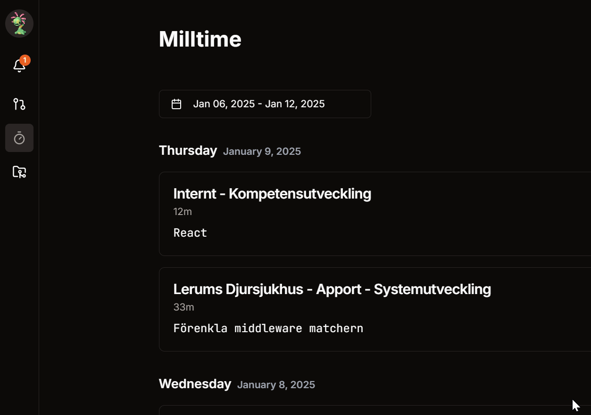
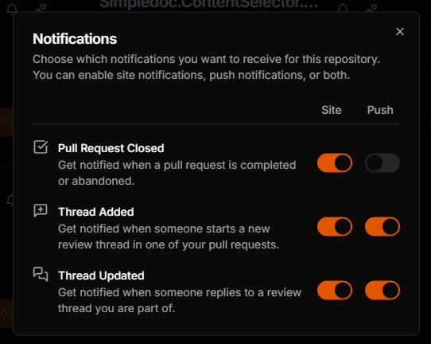
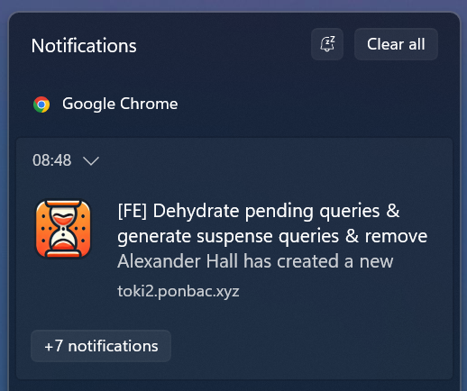

# Toki2 🕒

A Milltime and Azure DevOps integration platform built with Rust and React. Initially built because I wanted to try out Rust _(this is an excuse for the code quality)_.

## Overview

Toki2 helps you manage your time entries, track pull requests, and stay notified about important updates in Azure DevOps.

## Features

- ⌨️ Keyboard friendly

  - CMD+K menu to quickly navigate to different sections, start timer, etc.

- 🔄 Azure DevOps Integration

  - Pull Request tracking: see all your PRs across different projects and organizations in one place.
  - Work item integration: generate Milltime notes based on connected work items.

- ⏱️ Time Tracking

  - Clean and simple timer feature
  - Instant sync with Milltime, no more syncing at the end of the week
  - Statistics showing how you've spent your time

- 🔔 Real-time Notifications
  - Web Push notifications (you don't have to have the app open to get notified and can even get notified on your phone)
  - App notifications (can also see all notifications directly in the app)
  - Can configure which notifications you want to receive, and where you want to receive them
  - Ability to track entire repositories, or individual PRs
  - Notifications for closed PRs, new comments, replies, etc.

## Screenshots

🏠 Home Dashboard

⏱️ Time Tracking

🔄 Pull Requests

🔔 Notifications

### In-app Notifications

### Windows Notifications

## Project Structure

The project is organized into several key components:

### Backend Services

- `toki-api/`: The main backend service, handles authentication, data persistence, business logic, and communication with Azure DevOps and Milltime.
- `az-devops/`: Azure DevOps integration crate, custom client with the goal of making it easier to use the Azure DevOps API.
- `milltime/`: Milltime integration crate, created by reverse engineering the Milltime web app (no API exists as of yet).

### Frontend Application

- `app/`: React frontend
  - TanStack Router + TanStack Query
  - Tailwind CSS
  - shadcn/ui components
  - Service worker for Web Push notifications (https://developer.mozilla.org/en-US/docs/Web/API/Push_API)
  - PWA capabilities
