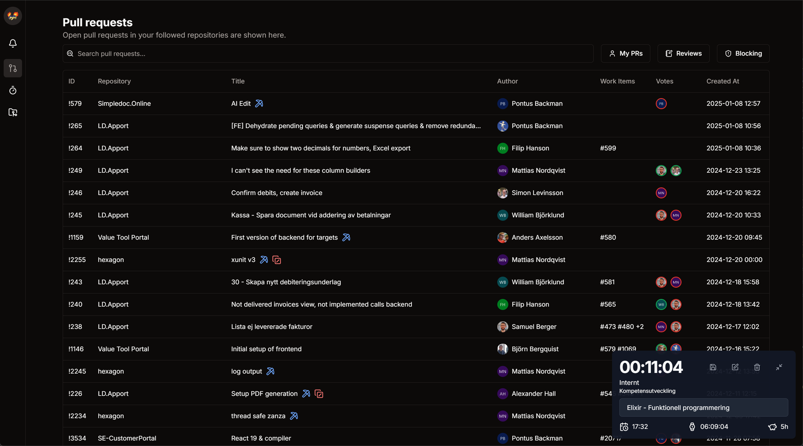
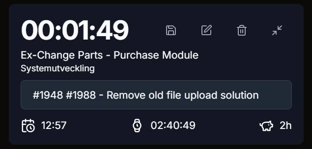
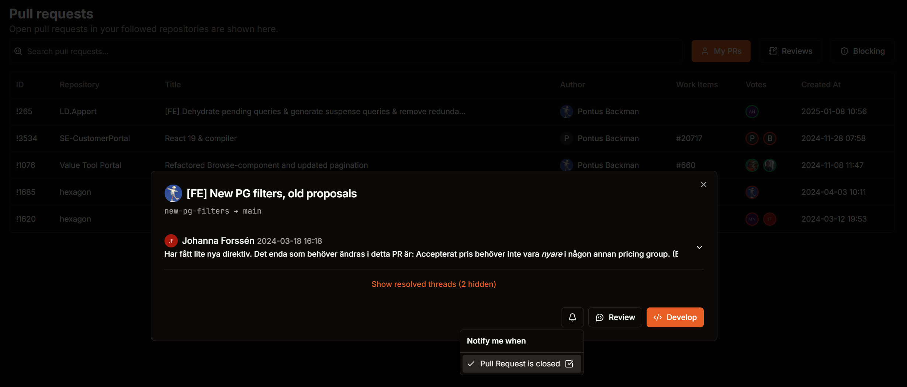
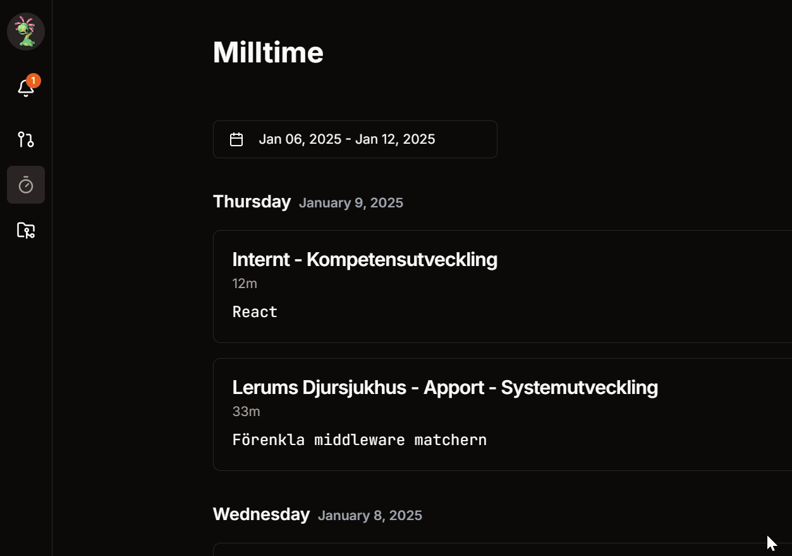
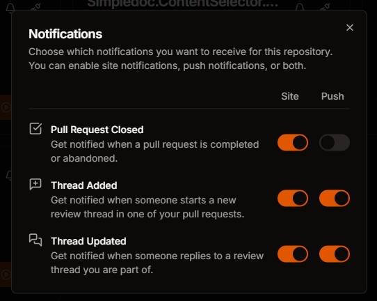
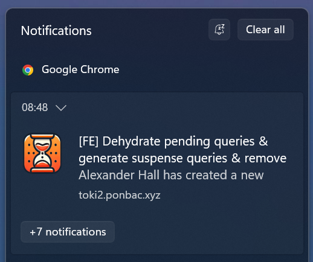

# Toki2 🕒

A Kleer (originally Milltime) and Azure DevOps integration platform built with Rust and React. Initially built because I wanted to try out Rust _(this is an excuse for the code quality)_.

## Documentation

- [User Manual (Swedish)](docs/MANUAL_SV.md) - Användarmanual

## Overview

Toki2 helps you manage your time entries, track pull requests, and stay notified about important updates in Azure DevOps.

## Features

- ⌨️ Keyboard friendly

  - CMD+K menu to quickly navigate to different sections, start timer, etc.

- 🔄 Azure DevOps Integration

  - Pull Request tracking: see all your PRs across different projects and organizations in one place.
  - Work item integration: generate time entry notes based on connected work items.

- ⏱️ Time Tracking

  - Clean and simple timer feature
  - Instant sync with Kleer, no more syncing at the end of the week
  - Statistics showing how you've spent your time

- 🔔 Real-time Notifications
  - Web Push notifications (you don't have to have the app open to get notified and can even get notified on your phone)
  - App notifications (can also see all notifications directly in the app)
  - Can configure which notifications you want to receive, and where you want to receive them
  - Ability to track entire repositories, or individual PRs
  - Notifications for closed PRs, new comments, replies, etc.

## Screenshots

<details>
<summary>🏠 Home Dashboard</summary>



</details>

<details>
<summary>⏱️ Time Tracking</summary>




</details>

<details>
<summary>🔄 Pull Requests</summary>



</details>

<details>
<summary>🔔 Notifications</summary>

### In-app Notifications





### Windows Notifications



</details>

## Project Structure

The project is organized into several key components:

### Backend Services

- `toki-api/`: The main backend service, handles authentication, data persistence, business logic, and communication with Azure DevOps and Kleer.
- `az-devops/`: Azure DevOps integration crate, custom client with the goal of making it easier to use the Azure DevOps API.
- `kleer/`: Kleer integration crate.

### Frontend Application

- `app/`: React frontend
  - TanStack Router + TanStack Query
  - Tailwind CSS
  - shadcn/ui components
  - Service worker for Web Push notifications (https://developer.mozilla.org/en-US/docs/Web/API/Push_API)
  - PWA capabilities

## Development

### Pull production DB into local Postgres

This repository provides a one-command snapshot pull from Fly production into your local database:

```bash
just db-prod-pull
```

Useful flags:

```bash
just db-prod-pull --yes
just db-prod-pull --yes --keep-dump
just db-prod-pull --fly-app toki2 --local-db toki
just db-prod-pull --fly-db-app toki-pg --proxy-port 15432
```

Requirements:

- `flyctl` (authenticated with `fly auth login`)
- `pg_dump`, `pg_restore`, `psql`
- local PostgreSQL running and reachable (defaults: `localhost:5433`, db `toki`)

If production host is a Fly private address (`*.flycast`), the script automatically starts a temporary `flyctl proxy` tunnel.

Safety notes:

- The command refuses to restore unless local host is `localhost`, `127.0.0.1`, or `::1`.
- By default it prompts before dropping/recreating the local database.
- The restored data is raw production data; no sanitization/redaction is performed.
